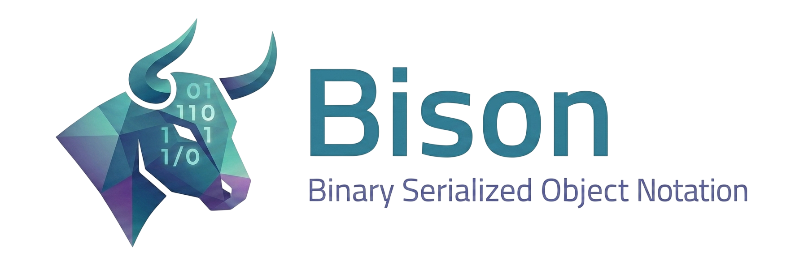

**Bison** is a C++20 library for serializing and deserializing objects in a compact binary format. It is conceptually similar to JSON — objects are self-describing, carrying both field names and values — but the wire format is binary rather than text, making it more efficient in size and parsing speed. Unlike Protocol Buffers, no external IDL schema is required.

## Features

- **Self-describing binary format** — field names and types are embedded in serialized data; no external schema required.
- **Dynamic, heterogeneous objects** — a single `dynamic` object holds fields of any supported type, including nested objects.
- **Method registration** — attach callable functions to objects at runtime; call them by name.
- **Class hierarchy & inheritance** — register named classes with parent/child relationships; fields and methods resolve through the inheritance chain.
- **Namespaces** — isolate class registries by name so identically-named classes in different namespaces don't collide.
- **Endian-safe serialization** — automatic byte-order conversion for portability.
- **Attribute metadata** — attach custom typed metadata to fields without changing the variant type.
- **JSON & YAML interoperability** — convert JSON or YAML text directly into `dynamic` objects.
- **Compile-time string hashing** — field names resolve to 32-bit FNV-1a hashes at compile time via `"name"_key`.
- **Buffer serializer** — `buffer_serializer` / `buffer_deserializer` for zero-virtual-dispatch I/O.
- **RMI (Remote Method Invocation)** — call methods and read/write fields on server-hosted objects over TCP, in-memory, or stdio transports.

## Requirements

| Requirement | Version |
|---|---|
| C++ standard | C++20 or later |
| CMake | 3.11 or later |
| nlohmann/json | bundled as git submodule |
| libyaml | bundled as git submodule |
| Google Test | bundled as git submodule (tests only) |
| Android NDK | r26+ (optional, for the Android build/binding) |

## Building

```bash
git clone --recurse-submodules https://github.com/carloslopezmdez/bison.git
cd bison
cmake -B build
cmake --build build --config Debug

# With tests:
cmake -B build -DPACKAGE_TESTS=ON
cmake --build build --config Debug
ctest --test-dir build -C Debug
```

Runs on Linux, MSYS2, native Windows (MSVC/mingw64), and Android (NDK, `arm64-v8a`/`x86_64`). For WSL/MSYS2/native-Windows/Android setup and CMake integration details, see [docs/building.md](docs/building.md).

## Quick Start

All public symbols live in the `bdg::bison` namespace.

```cpp
#include "src/bison/bison.hpp"
#include <sstream>
using namespace bdg::bison;

int main() {
    dynamic obj{"MyClass"_key, {
        {"name"_key,  std::string{"Alice"}},
        {"score"_key, int32_t{42}},
        {"active"_key, true}
    }};

    obj["score"_key] = int32_t{100};
    std::string name = obj["name"_key].as<std::string>();

    std::stringstream ss;
    obj.serialize(stream_serializer(ss));

    auto restored = dynamic::deserialize(stream_deserializer(ss));
    int32_t score = restored["score"_key].as<int32_t>();  // 100
}
```

New to Bison? [docs/tutorial.md](docs/tutorial.md) walks through every concept below with runnable examples.

## Core Concepts

### `dynamic` — runtime object

Holds a map of named fields (accessed by hashed key) and a map of callable methods. Field types:

| C++ type | Description |
|---|---|
| `std::monostate` | Empty / unset |
| `hash_t` (`uint32_t`) | Hashed key identifier |
| `key_t` | Hashable name |
| `bool` | Boolean |
| `int32_t` | 32-bit integer |
| `float` | 32-bit float |
| `std::shared_ptr<dynamic>` | Nested object |
| `std::string` | Text |
| `std::vector<bool/int32_t/float/uint8_t>` | Typed arrays |

### Keys — compile-time hashing

```cpp
auto k = "position"_key;  // constexpr key_t, implicitly convertible to hash_t
obj[k] = 3.14f;
```

### Serialization modes

```cpp
// Standard — self-describing, includes field names:
obj.serialize(stream_serializer(out));
auto copy = dynamic::deserialize(stream_deserializer(in));

// Buffer variant (faster, no virtual dispatch):
buffer_serializer buf;
obj.serialize(buf);
bdg::bison::buffer bytes = buf.release();  // std::vector<uint8_t>

// Schema-driven — compact, omits field keys (requires matching class registry):
obj.serializeWithSchema(stream_serializer(out));
auto copy = dynamic::deserializeWithSchema(stream_deserializer(in));
```

### Method registration

```cpp
dynamic obj{"Calculator"_key};
obj.addMethod("add"_key, [](dynamic& self, const dynamic& params) -> dynamic {
    dynamic result;
    result["value"_key] = params["a"_key].as<int32_t>() + params["b"_key].as<int32_t>();
    return result;
});
dynamic args;
args["a"_key] = int32_t{3};
args["b"_key] = int32_t{4};
dynamic result = obj.call("add"_key, args);
```

### Class inheritance & namespaces

```cpp
auto base = dynamic_ptr{"Shape"_key, {{"color"_key, std::string{"red"}}}};
dynamic::addClass(0U, base);                  // 0U = global namespace, no parent

auto circle = dynamic_ptr{"Circle"_key, {{"radius"_key, 1.0f}}};
dynamic::addClass(0U, circle, "Shape"_key);   // parent = "Shape"_key

dynamic c = dynamic::instantiate("Circle"_key);
c["color"_key];               // inherited from Shape
c.call("describe"_key, {});   // method inherited from Shape
```

`addClass(ns, klass, parent)` and `instantiate(ns, klass)` take a namespace key (`0U` = global); a distinct `"name"_key` isolates identically-named classes registered in different namespaces from one another.

### More: attributes, JSON/YAML, user data

- **Field attributes** — attach typed metadata to a `field` without touching its value: `field f{3.14f, attr<Range>(0.0f, 10.0f)}`, read back with `f.findAttribute<Range>()`.
- **JSON/YAML import** — `extensions::from_json(text)` / `extensions::from_yaml(text)` return a `dynamic_ptr` built from the parsed document.
- **User data** — `obj.setUserdata(ptr)` / `obj.getUserdata()` attach an arbitrary `userdata` subclass to an instance; never serialized.

See [docs/tutorial.md](docs/tutorial.md) for runnable examples of each.

## RMI — Remote Method Invocation

The RMI subsystem lets a client invoke methods and read/write fields on objects hosted by a server, over a transport of choice, using request/response async futures; the server can also push events to connected clients.

**Transports:** `socket_*_transport` (TCP), `tls_socket_*_transport` (TLS-secured TCP, server-authenticated by default with optional mutual TLS — see [docs/tls.md](docs/tls.md)), `named_pipe_*_transport` (named pipe / Unix domain socket), `memory_*_transport` (in-process queues), `stream_*_transport` (any `std::iostream`, e.g. stdin/stdout), and `term_*_transport` (`--transport=term`, an interactive terminal hop framed as OSC-99 for ConPTY-safe relaying). `rmi::standalone` combines client and server in-process with no serialization overhead.

**Server** — register classes, then listen:

```cpp
#include "src/rmi/rmi.hpp"
using namespace bdg::bison;

auto proto = dynamic_ptr{"Calculator"_key, {{"result"_key, int32_t{0}}}};
proto->addMethod("add"_key, [](dynamic& self, const dynamic& p) -> dynamic {
    self["result"_key] = p["a"_key].as<int32_t>() + p["b"_key].as<int32_t>();
    return dynamic{};
});
dynamic::addClass(0U, proto);

rmi::server srv{rmi::socket_server_transport{}};
srv.listen(dynamic{});   // blocks until stopped
```

**Client** — connect, instantiate a remote object, call methods:

```cpp
#include "src/rmi/rmi.hpp"
using namespace bdg::bison;

rmi::client c{rmi::socket_client_transport{"localhost", 7777}};
c.connect();

auto proxy = c.instantiate(0U, "Calculator"_key, dynamic{}).get();

dynamic args;
args["a"_key] = int32_t{10};
args["b"_key] = int32_t{3};
proxy.call("add"_key, std::move(args)).get();

auto snapshot = proxy.get().get();   // retrieve all fields
int32_t result = snapshot["result"_key].as<int32_t>();  // 13

c.destroy(std::move(proxy));
c.disconnect();
```

Key proxy operations: `set(fields)`, `get()`, `get(projection)`, `clear()`, `call(name, args)`, `onEvent(name, handler)`.

See [docs/examples.md](docs/examples.md) for running the socket examples and for `--transport=term` hop-mode usage on `bison-cli`/`calc-server`.

## API Reference

Full Doxygen-style documentation is embedded in `src/bison/bison.hpp`. Generate HTML docs with:

```bash
doxygen Doxyfile
```

## Further Documentation

| Document | Contents |
|---|---|
| [docs/tutorial.md](docs/tutorial.md) | Beginner-friendly walkthrough of the library with runnable examples |
| [docs/building.md](docs/building.md) | Linux/WSL/MSYS2/native-Windows/Android setup, CMake integration |
| [docs/examples.md](docs/examples.md) | Running C++, RMI socket, stdio PTY, and benchmark examples |
| [docs/bindings.md](docs/bindings.md) | C++ (header-only), Python, C#, and Android (Java/Kotlin) binding setup and usage |
| [docs/tls.md](docs/tls.md) | Configuring `tls_socket_transport`: server-only vs. mutual TLS, certificate setup |
| [docs/performance.md](docs/performance.md) | Benchmark architecture and optimization notes |
| [docs/profiling.md](docs/profiling.md) | Recording Perfetto traces: `BISON_TRACE_SCOPE`, start/stop capture, viewing in ui.perfetto.dev |
| [docs/publishing-binaries.md](docs/publishing-binaries.md) | Release runbook for the downloadable binary zips attached to each GitHub Release: the CI workflow, platform coverage, per-release steps |
| [docs/publishing-python.md](docs/publishing-python.md) | Release runbook for the `bison-abi` PyPI package: one-time Trusted Publishing setup, TestPyPI rehearsal, per-release steps |
| [FORMAT.md](FORMAT.md) | Binary wire format specification |

## License

MIT License © 2025 Binary Dice Games. See [LICENSE](LICENSE) for the full text.
